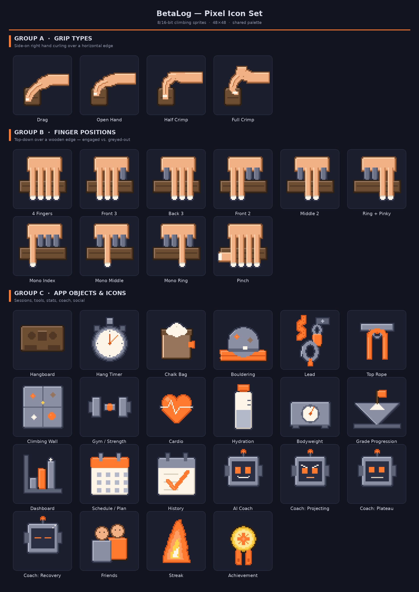

# BetaLog — Pixel Icon Set

Retro 8/16-bit game-sprite icons for BetaLog. Crisp hard pixel edges, no
anti-aliasing, transparent background, one shared limited palette, a 1px dark
outline on every sprite and simple top-left light / bottom-right shadow. Each
sprite is authored on a 48×48 grid.



## Contents

| File / folder | What it is |
|---|---|
| `betalog-pixel-icons.png` | Labelled contact sheet of the whole set on a `#12141F` slate background |
| `sprites/` | Every sprite as a transparent PNG at 5× (240×240), good for the web/README |
| `sprites-48/` | Every sprite at native 48×48, transparent — use these in the app |
| `engine.py` | The tiny pixel rasteriser (palette, primitives, per-material outline pass) |
| `sprites.py` | All 36 sprite definitions |
| `generate.py` | Renders every PNG and the contact sheet |

## Groups

**Group A — Grip types** (side-on right hand curling over a horizontal edge):
`drag`, `open_hand`, `half_crimp`, `full_crimp`.

**Group B — Finger positions** (top-down over a wooden edge; engaged fingers are
full-length skin with chalk tips, unused fingers are short and greyed):
`four_fingers`, `front_three`, `back_three`, `front_two`, `middle_two`,
`ring_pinky`, `mono_index`, `mono_middle`, `mono_ring`, `pinch`.

**Group C — App objects & icons:** `hangboard`, `timer`, `chalk_bag`,
`bouldering`, `lead`, `top_rope`, `wall`, `gym`, `cardio`, `hydration`,
`bodyweight`, `grade`, `dashboard`, `schedule`, `history`, `coach`,
`coach_projecting`, `coach_plateau`, `coach_recovery`, `friends`, `streak`,
`achievement`.

## Palette

| Role | Hex |
|---|---|
| skin mid / light / shadow / outline | `#F2B184` `#FAD2AC` `#C67E4E` `#74482A` |
| chalk white | `#FDF5E8` |
| wood/hold body / top | `#6E4E32` `#96745C` |
| rock grey | `#8A8FA3` |
| orange accent | `#FF7A2F` |

Yellow (`#FFD24A`) is used sparingly for gold on the achievement medal and the
flame core.

## Regenerating

```
pip install Pillow
python3 generate.py
```

Edit a sprite in `sprites.py` (each is a small function that draws onto a
`Sprite`) and re-run. `SCALE` in `generate.py` controls the export/contact-sheet
size.
